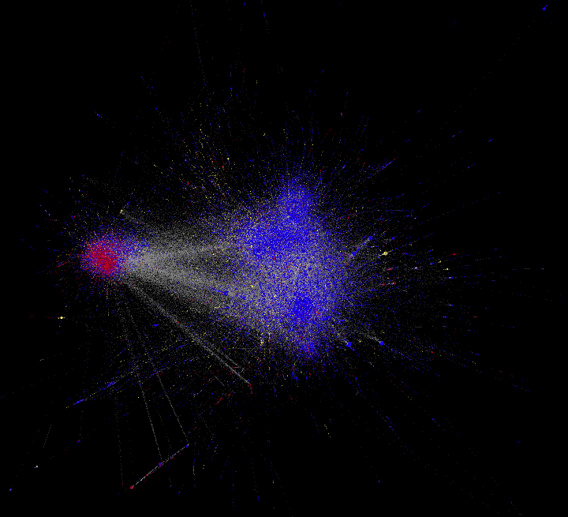

This is a research project on exploring  of online vaccination discussion and how it manifested in retweet network communities.

Three percent of the dataset is labeled as pro-vaccine, anti-vaccine, or neutral to vaccination. The labeled data is available in this repository and feel free to use it. The whole dataset is not included but available upon request.

These two pretty pictures are from this research as well:

  
  

How the data was labeled?
In the labeled dataset we shared here, label "-1" means anti-vaccine sentiment, label "1" refers to pro-vaccine sentiment and "0" is neutral. We noticed that there's barely any truly "neutral" tweets in our dataset, we define neutral as tweets that do not show any leaning to either pro- or anti-vaccine sentiment. Two people labeled the data with 10 percent overlap. Before labeling, a criteria was established on how to define each labels. While positive and negative is more intuitive, they then agreed on defining neural tweets as those only contain facts, such as news reports or research results. The conflict labels from two annotators were solved by manual checking. 